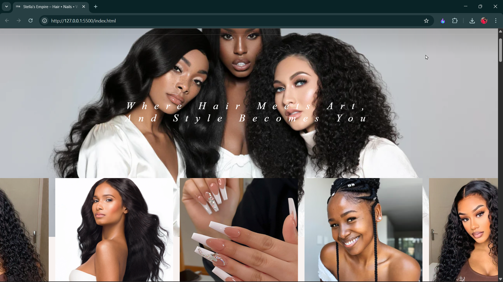

# 💇‍♀️ Stella Empire
*"Where Hair Meets Art, and Style Becomes You"* 

**Stella Empire** is a premium hair and beauty brand website designed to showcase luxury hairstyling, nails, and fashion services.  
This project highlights a stylish, modern, and responsive web presence for the brand.

---



---

## 🔗 Live Demo

Check out the live site: [Stella Empire Page](https://your-live-demo-link.com)

---


## ✨ Features

- Elegant wordmark logo for **Stella Empire**
- Modern, responsive design (mobile-first)
- Animated hero section with tagline
- Sections for **Services**, **Gallery**, and **Contact**
- Built with clean HTML, CSS, and optional frameworks
- SEO-friendly structure with metadata
- Smooth user experience with minimal animations

---


---

## 🛠️ Tech Stack

- **Frontend:** HTML5, CSS3, JavaScript (Vanilla)  
- **Styling:** Custom CSS + Google Fonts (Playfair Display, Great Vibes)  
- **Optional:** UIkit / Bootstrap for layout & responsiveness  

---

## 🚀 Getting Started

Clone the repository:

```bash
git clone https://github.com/yourusername/stella-empire.git
cd stella-empire
```
## 📬 Contact

For inquiries or collaborations:
Stella's Empire – Luxury Hair & Beauty
📱 Instagram: @StellasEmpire
